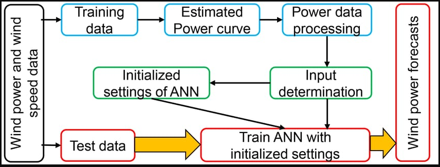
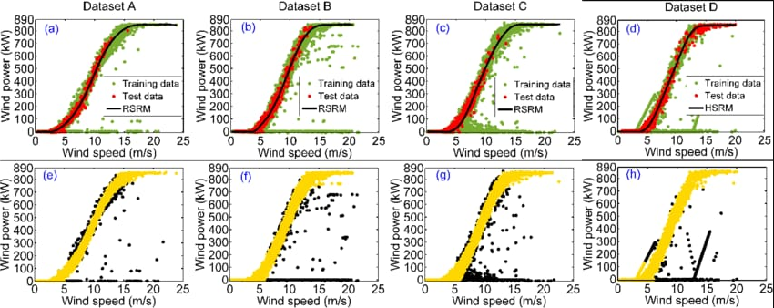
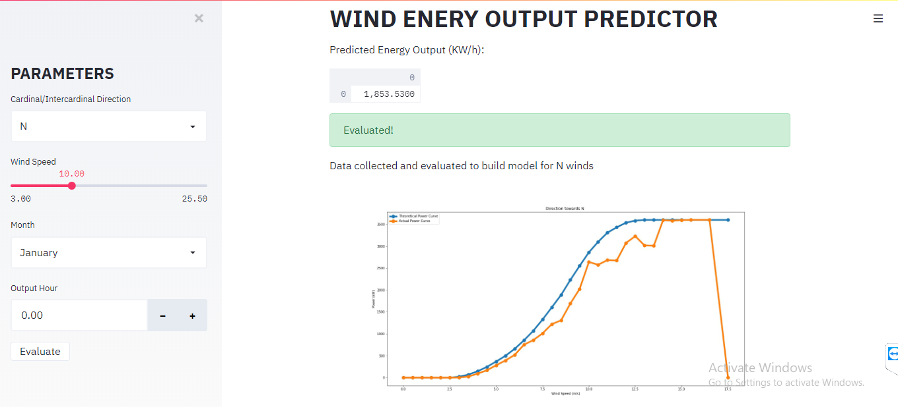

# Predicting-the-Energy-Output-of-Wind-Turbine-Based-on-Weather-Conditions-IBM Watson

* ## Introduction:
  Wind speed/power has received increasing attention around the earth due to its renewable nature as well as environmental               friendliness. With the global installed wind power capacity rapidly increasing, the wind industry is growing into a large-scale         business. Reliable short-term wind speed forecasts play a practical and crucial role in wind energy conversion systems, such as the     dynamic control of wind turbines and power system scheduling. A precise forecast needs to overcome problems of variable energy         production caused by fluctuating weather conditions. Power generated by wind is highly dependent on the wind speed. Though it is       highly non-linear, wind speed follows a certain pattern over a certain period of time. We exploit this time series pattern to gain     useful information and use it for power prediction.
  
  
* ## Table of Content
    * AIM
    * Project Description 
    * Process Flow - Flowchart
    * Skill Used
    * Demo
    * Conclusion
    * User

* ## AIM:
    Predicting The Energy Output Of Wind Turbine Based On Weather Conditions Watson Auto AI
    
    
* ## Process Flow - Flowchart:
    
    
    
    ### Data Set Flow:
    
    
      
    
* ## Project Description:
  Wind energy plays an increasing role in the supply of energy world-wide. The energy output of a wind farm is highly dependent on       the weather conditions present at its             site. If the output can be predicted more accurately, energy suppliers can           coordinate the collaborative production of different energy sources more efficiently to avoid           costly overproduction. In       this paper, we predict energy prediction based on weather data and analyse the important parameters as well as their correlation       on the energy output.
    ### Solution:
     Our aim is to map weather data to energy production. We wish to show that even data that is publicly available for weather              stations close to wind farms can be used to give a       good prediction of the energy output. Furthermore, we examine the impact      of different weather conditions on the energy output of wind farms. We are building an IBM Watson         AutoAI Machine Learning      technique to predict the energy output of wind turbine. The model is deployed on IBM cloud to get scoring end point which can be        used as API in mobile     app or web app building. We are developing a web application which is built using node red service. We        make use of the scoring end point to give user input values to the           deployed model. The model prediction is then              showcased on User Interface to predict the energy output of wind turbine
    
* ## Skills Required:
      Python, Python For Data Analysis, Machine Learning, IBM Cloud, IBM Watson.
      
* ## Demo:
    
    
* ## User:
    [Aman Bahuguna](https://github.com/amanbh123)

      
 
